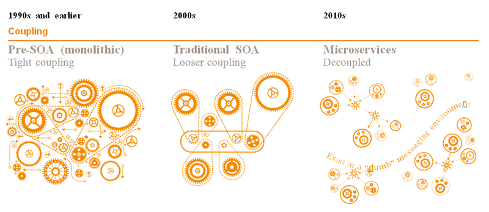

# Tìm hiểu Microservices
---
## Cơ bản
`Micro` là rất nhỏ, `service` là dịch vụ, vậy `microservice` nghĩa là… dịch vụ vô cùng nhỏ. Nói đơn giản, microservice là một kiếu kiến trúc phần mềm. Các module trong phần mềm này được chia thành các service rất nhỏ (microservice).

1 số lý thuyết coi Microservices là một hình thức làm khác của SOA (Service-Oriented Architecture) hay còn được hiểu là kiến trúc hướng dịch vụ. mô hình Microservice mang lại những lợi ích đáng kể trong việc xây dựng những giải pháp phức tạp, đặc biệt là nó tạo điều kiện cho việc áp dụng agile lên project một cách hiệu quả.

## Kiến trúc một khối
Kiến trúc mà chúng ta thường dùng để xây dựng phần mềm – kiến trúc monolith (một khối). Toàn bộ các module (view, business, database, report) đều được gom chung vào một project lớn.

Kiến trúc này hoạt động khá tốt vì nó đơn giản, dễ code. Tuy nhiên, khi phần mềm trở nên lớn và phức tạp thì nó lại dần bộc lộ nhược điểm. Do các module dính với nhau thành … một cục, khi muốn nâng cấp một module, ta phải deploy lại toàn bộ code; khi muốn phục vụ nhiều người dùng, ta phải nâng cấp server.

Mỗi lần deploy phiên bản mới cũng sẽ là một cực hình, thậm chí tệ hại nếu thời gian down time cho việc khởi động lại là quá lớn. Điều này cũng ảnh hưởng khi lập trình viên đang debug ứng dụng, tưởng tượng một ứng dụng redeploy mất 10 phút thì trong 10 phút đó lập trình viên sẽ làm gì, rõ rành nó ảnh hưởng rất lớn đến năng suất làm việc.

Khái niệm triển khai đều đặn (continous deployment). Những ứng dụng SaaS (Software application as Service) tiên tiến, cần phải cập nhật vài lần trong một ngày. Quá khó để triển khai lại cả một ứng dụng cực lớn chỉ vì một số nâng cấp nhỏ. Hoạt động bị ngưng trệ, kiểm thử lại sau triển khai sẽ lâu công hơn. Kết quả là việc này sẽ khó mà áp dụng với ứng dụng một khối. Nếu không muốn nói là không thể.

## Kiến trúc Microservice
Đối với kiến trúc microservice, thay vì gom tất cả module thành một khối (monolith), ta tách các module thành những service siêu nhỏ. Mỗi service sẽ được đặt trên một server riêng (Có thể dùng server cloud như AWS hoặc Azure), giao tiếp với nhau thông qua mạng (Gửi nhận message qua giao thức HTTP hoặc sử dụng MessageQueue)..

## Ưu nhược kiến trúc Microservice
Hiện nay, các ứng dụng rất lớn và liên tục được update. Với kiến trúc monolith, việc gom toàn bộ ứng dụng vào một cục làm việc nâng cấp trở nên khó khăn và mất thời gian.

Để giải quyết, lập trình viên bắt đầu tách dần ứng dụng lớn ra thành các service nhỏ. Mỗi service quản lý một cơ sở dữ liệu riêng, nằm trên một server riêng, tách biệt hoàn toàn với nhau. Kiến trúc microservice ra đời từ đó.

### Ưu điểm:
- Dễ nâng cấp và scale.
- Với monolith, các module sử dụng chung 1 ngôn ngữ/framework. Với microservice, các service nằm tách biệt nhau, bạn có thể thoải mái sử dụng ngôn ngữ lập trình riêng, database riêng. VD service xử lý ảnh có thể viết bằng C++, service tổng hợp data có thể viết bằng Python.

### Nhược điểm
- Các module giao tiếp qua mạng nên có thể tốc độ không cao bằng monolith. Mỗi module phải tự giải quyết các vấn đề về bảo mật, transaction, lỗi kết nối, quản lý log files.
- Mỗi service sử dụng một database riêng, việc đảm bảo tính đồng nhất trong dữ liệu sẽ trở nên phức tạp.
- Sử dụng nhiều service nên việc theo dõi, quản lý các service này sẽ phức tạp hơn. Do vậy, một số tool/công nghệ ra đời để phục vụ cho việc này (Docker, Ansible, Salt, Octopus, …).
- Cần một đội ngũ có khả năng và trình độ: Software Architect để phân tách module, Techinical Leader để setup workflow, IT để setup CI, deploy lên cloud….

## Nguồn

https://toidicodedao.com/2017/02/21/tong-quan-micro-service/

https://codeaholicguy.com/2015/11/13/gioi-thieu-ve-microservices-phan-1-dia-nguc-kien-truc-mot-khoi/
